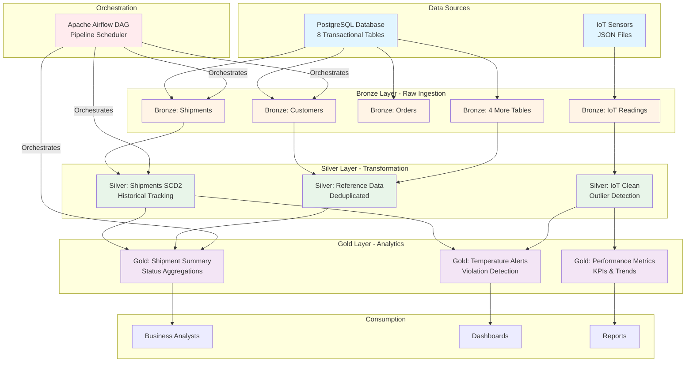
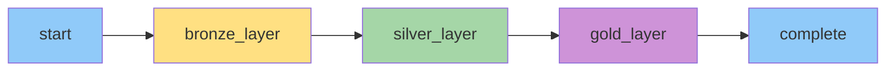
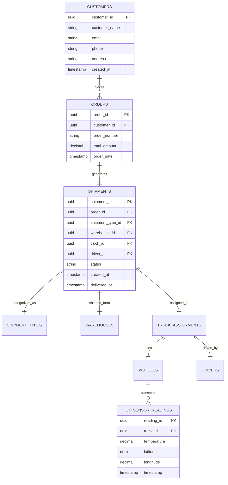

# System Design Document
## Smart Logistics Data Lakehouse Platform

---

## 1. Architecture Overview

### **High-Level Architecture**

The Smart Logistics Data Lakehouse implements a modern, container-based data platform using the **Medallion Architecture** pattern (Bronze → Silver → Gold) orchestrated by Apache Airflow.

### **Key Design Principles**

1. **Separation of Concerns**: Clear layers for ingestion, transformation, and analytics
2. **Idempotency**: Pipeline can be re-run safely without side effects
3. **Scalability**: Horizontal scaling via Spark cluster
4. **Observability**: Comprehensive logging and monitoring
5. **Data Quality**: Built-in validation and quality scoring

---

## 2. Data Flow Diagram

### **End-to-End Data Flow**



### **Layer Descriptions**

| Layer | Purpose | Data State | Output Format |
|-------|---------|-----------|---------------|
| **Bronze** | Raw ingestion | Unmodified source data + metadata | CSV files |
| **Silver** | Cleansing & transformation | Deduplicated, validated, quality-scored | CSV files |
| **Gold** | Business analytics | Aggregated, joined, business-ready | CSV files |

---

## 3. Component Architecture

### **Docker Container Architecture**

```mermaid
graph TB
    subgraph "Docker Network: assignment4_default"
        subgraph "Data Services"
            PG1[postgres<br/>PostgreSQL 15<br/>Port: 5432]
            PG2[postgres-airflow<br/>Airflow Metadata DB<br/>Port: 5432]
        end
        
        subgraph "Processing Services"
            SM[spark-master<br/>Spark Master<br/>Port: 8080, 7077]
            SW[spark-worker<br/>Spark Worker<br/>Port: 8081]
        end
        
        subgraph "Orchestration Services"
            AI[airflow-init<br/>DB Initialization]
            AS[airflow-scheduler<br/>DAG Scheduler]
            AW[airflow-webserver<br/>Web UI<br/>Port: 8090]
        end
        
        subgraph "Shared Volumes"
            V1[/opt/data<br/>Delta Lake Storage]
            V2[/opt/airflow/dags<br/>DAG Definitions]
            V3[/opt/spark-scripts<br/>Python Scripts]
        end
    end
    
    PG1 -.Database.-> SM
    PG2 -.Metadata.-> AS
    PG2 -.Metadata.-> AW
    
    AS -.Triggers.-> SM
    AS -.Monitors.-> SW
    AW -.UI.-> AS
    
    SM --> V1
    SW --> V1
    AS --> V2
    AS --> V3
    SM --> V3
    
    AI -.Initializes.-> PG2
    
    style PG1 fill:#4CAF50
    style PG2 fill:#4CAF50
    style SM fill:#FF9800
    style SW fill:#FF9800
    style AS fill:#2196F3
    style AW fill:#2196F3
    style AI fill:#9E9E9E
    style V1 fill:#FFC107
    style V2 fill:#FFC107
    style V3 fill:#FFC107
```

### **Container Specifications**

| Container | Image | Resources | Purpose |
|-----------|-------|-----------|---------|
| **postgres** | postgres:15 | 1 CPU, 2GB RAM | Main transactional database |
| **postgres-airflow** | postgres:15 | 1 CPU, 1GB RAM | Airflow metadata storage |
| **spark-master** | bitnami/spark:3.5.0 | 2 CPU, 4GB RAM | Spark cluster coordinator |
| **spark-worker** | bitnami/spark:3.5.0 | 2 CPU, 4GB RAM | Spark task executor |
| **airflow-scheduler** | custom-airflow:2.8.0 | 1 CPU, 2GB RAM | DAG orchestration |
| **airflow-webserver** | custom-airflow:2.8.0 | 1 CPU, 1GB RAM | Web UI & API |

---

## 4. Medallion Architecture Design

### **Bronze Layer (Raw Data)**

**Purpose**: Exact copy of source data with minimal transformation

**Transformations**:
- ✅ Add `ingestion_timestamp`
- ✅ Add `source_system` metadata
- ✅ Add `source_table` identifier
- ❌ No data modification

**File Structure**:
```
/opt/data/delta-lake/bronze/
├── customers/
│   └── customers_20260209_142030.csv
├── shipments/
│   └── shipments_20260209_142035.csv
├── iot_sensor_readings/
│   └── iot_readings_20260209_142040.csv
└── [5 more tables...]
```

**Schema Example** (Shipments):
```
shipment_id, order_id, shipment_type_id, warehouse_id, truck_id, driver_id,
status, created_at, updated_at, delivered_at,
ingestion_timestamp, source_system, source_table
```

---

### **Silver Layer (Cleaned Data)**

**Purpose**: Business-ready, validated data with quality metrics

**Transformations**:

#### **For Simple Tables (Customers, Orders, etc.)**
- ✅ Deduplication
- ✅ Add `silver_processed_at` timestamp

#### **For Shipments (SCD Type 2)**
- ✅ Add `surrogate_key` (incrementing ID)
- ✅ Add `valid_from` (start of validity period)
- ✅ Add `valid_to` (end of validity period, NULL if current)
- ✅ Add `is_current` (boolean flag)
- ✅ Add `version` (incrementing version number)

**SCD Type 2 Example**:
```csv
surrogate_key,shipment_id,status,valid_from,valid_to,is_current,version
1,SHP-001,Created,2026-02-01 10:00,2026-02-02 14:30,False,1
2,SHP-001,In Transit,2026-02-02 14:30,2026-02-05 09:15,False,2
3,SHP-001,Delivered,2026-02-05 09:15,,True,3
```

#### **For IoT Sensor Data**
- ✅ Parse timestamps
- ✅ Outlier detection (3 methods):
  1. Range validation: -30°C < temp < 50°C
  2. Statistical: Z-score > 3.0
  3. Rapid change: Temperature delta > 10°C
- ✅ GPS validation: Valid lat/lon ranges
- ✅ Quality scoring: 0-100 scale
- ✅ Data quality flags: CLEAN / FLAGGED

**Quality Scoring Algorithm**:
```python
quality_score = 100 if no_issues else 50
data_quality_flag = "CLEAN" if quality_score == 100 else "FLAGGED"
```

**File Structure**:
```
/opt/data/delta-lake/silver/
├── shipments_scd2/
│   └── shipments_scd2_20260209_142055.csv
├── iot_sensor_readings_clean/
│   └── iot_clean_20260209_142100.csv
└── [reference tables...]
```

---

### **Gold Layer (Analytics)**

**Purpose**: Pre-aggregated business metrics for fast querying

**Datasets**:

#### **1. Shipment Summary**
```csv
status,count,created_at
Delivered,52,2026-02-09 14:21:00
In Transit,19,2026-02-09 14:21:00
Out for Delivery,9,2026-02-09 14:21:00
Created,8,2026-02-09 14:21:00
Cancelled,7,2026-02-09 14:21:00
Assigned,5,2026-02-09 14:21:00
```

**Business Question Answered**: "What is the current distribution of shipments by status?"

#### **2. Temperature Violation Alerts** (Future)
```csv
shipment_id,truck_id,violation_time,temperature,threshold_min,threshold_max,severity
SHP-042,TRK-007,2026-02-09 12:45,15.2,2.0,8.0,HIGH
SHP-089,TRK-012,2026-02-09 13:20,-30.5,-25.0,-18.0,CRITICAL
```

**Business Question Answered**: "Which shipments have temperature compliance issues?"

**File Structure**:
```
/opt/data/delta-lake/gold/
├── shipment_summary/
│   └── summary_20260209_142115.csv
└── [future analytics tables...]
```

---

## 5. Airflow DAG Design

### **DAG Structure**



### **Task Configuration**

| Task | Type | Retry | Timeout | Dependencies |
|------|------|-------|---------|--------------|
| **start** | EmptyOperator | 0 | N/A | None |
| **bronze_layer** | PythonOperator | 1 | 5 min | start |
| **silver_layer** | PythonOperator | 1 | 5 min | bronze_layer |
| **gold_layer** | PythonOperator | 1 | 3 min | silver_layer |
| **complete** | EmptyOperator | 0 | N/A | gold_layer |

### **DAG Parameters**

```python
default_args = {
    'owner': 'data-eng',
    'depends_on_past': False,
    'email_on_failure': False,
    'retries': 1,
    'retry_delay': timedelta(minutes=2),
}

dag = DAG(
    'medallion_airflow_pipeline',
    default_args=default_args,
    schedule_interval=None,  # Manual trigger only
    start_date=datetime(2026, 2, 6),
    catchup=False,
    tags=['production', 'medallion', 'airflow-ready'],
)
```

---

## 6. Data Models

### **Source Database Schema** (PostgreSQL)



### **Key Tables**

#### **Shipments**
- **Primary Key**: `shipment_id` (UUID)
- **Foreign Keys**: `order_id`, `shipment_type_id`, `warehouse_id`, `truck_id`, `driver_id`
- **Status Values**: Created, Assigned, In Transit, Out for Delivery, Delivered, Cancelled
- **Timestamps**: `created_at`, `updated_at`, `delivered_at`

#### **IoT Sensor Readings**
- **Primary Key**: `reading_id` (UUID)
- **Foreign Key**: `truck_id` (UUID)
- **Metrics**: `temperature` (°C), `latitude`, `longitude`
- **Frequency**: Every 1-5 minutes per truck
- **Volume**: ~7,000 readings per 100 shipments

---

## 7. Processing Logic

### **Bronze Layer Processing**

```python
# Pseudo-code for Bronze ingestion
def ingest_table(table_name):
    # Connect to PostgreSQL
    df = pd.read_sql(f"SELECT * FROM logistics.{table_name}", conn)
    
    # Add metadata
    df['ingestion_timestamp'] = datetime.now()
    df['source_system'] = 'PostgreSQL'
    df['source_table'] = table_name
    
    # Save to Bronze
    output_file = f"{BRONZE_PATH}/{table_name}/{table_name}_{timestamp}.csv"
    df.to_csv(output_file, index=False)
```

### **Silver Layer Processing (Outlier Detection)**

```python
# Pseudo-code for IoT outlier detection
def detect_outliers(df):
    # Method 1: Range validation
    df['is_out_of_range'] = (df['temperature'] < -30) | (df['temperature'] > 50)
    
    # Method 2: Statistical (Z-score)
    df['temp_mean'] = df.groupby('truck_id')['temperature'].transform('mean')
    df['temp_std'] = df.groupby('truck_id')['temperature'].transform('std')
    df['z_score'] = (df['temperature'] - df['temp_mean']) / df['temp_std']
    df['is_statistical_outlier'] = abs(df['z_score']) > 3.0
    
    # Method 3: Rapid change
    df['prev_temp'] = df.groupby('truck_id')['temperature'].shift(1)
    df['temp_change_rate'] = abs(df['temperature'] - df['prev_temp'])
    df['is_rapid_change'] = df['temp_change_rate'] > 10.0
    
    # Combined flag
    df['is_outlier'] = (df['is_out_of_range'] | 
                         df['is_statistical_outlier'] | 
                         df['is_rapid_change'])
    
    # Quality score
    df['quality_score'] = np.where(df['is_outlier'], 50, 100)
    
    return df
```

### **Gold Layer Processing (Aggregation)**

```python
# Pseudo-code for shipment summary
def create_summary(df):
    summary = df.groupby('status').size().reset_index(name='count')
    summary['created_at'] = datetime.now()
    return summary
```

---

## 8. File Naming Conventions

### **Standard Pattern**

```
{layer}/{entity}/{entity}_{timestamp}.csv
```

**Examples**:
- `bronze/shipments/shipments_20260209_142030.csv`
- `silver/iot_sensor_readings_clean/iot_clean_20260209_142100.csv`
- `gold/shipment_summary/summary_20260209_142115.csv`

### **Timestamp Format**

```
YYYYMMDD_HHMMSS
```

**Example**: `20260209_142030` = February 9, 2026 at 2:20:30 PM

---

## 9. Technology Stack Details

### **Core Technologies**

| Technology | Version | Purpose | Justification |
|------------|---------|---------|---------------|
| **Python** | 3.8+ | Primary language | Rich data ecosystem |
| **Apache Spark** | 3.5.0 | Data processing | Scalable, distributed |
| **Apache Airflow** | 2.8.0 | Orchestration | Industry standard |
| **PostgreSQL** | 15 | OLTP database | Reliability, ACID compliance |
| **Docker** | 20.10+ | Containerization | Portability, isolation |
| **Pandas** | 2.0.3 | Data manipulation | Fast, intuitive API |
| **NumPy** | 1.24.3 | Numerical computing | Statistical functions |

### **Python Libraries**

```python
# Data Processing
pandas==2.0.3
numpy==1.24.3
psycopg2-binary==2.9.9

# Data Generation (Development)
faker==22.0.0

# Future Enhancements
# pyspark==3.5.0 (for distributed processing)
# delta-spark==3.0.0 (for Delta Lake format)
# great-expectations==0.18.0 (for data quality tests)
```

---

## 10. Deployment Architecture

### **Local Development**

```
docker-compose up -d
```

**Resource Requirements**:
- **CPU**: 8 cores minimum
- **RAM**: 16GB minimum
- **Disk**: 20GB for containers + data
- **Network**: Docker internal network

### **Production Considerations** (Future)

#### **Cloud Architecture** (AWS Example)
- **Compute**: EMR cluster for Spark
- **Storage**: S3 for Delta Lake
- **Orchestration**: Managed Airflow (MWAA)
- **Database**: RDS PostgreSQL
- **Monitoring**: CloudWatch + Datadog

#### **Scaling Strategy**
- Horizontal: Add more Spark workers
- Vertical: Increase worker memory/CPU
- Data partitioning by date for faster queries

---

## 11. Security Design

### **Current Implementation**

| Layer | Security Measure |
|-------|------------------|
| **Network** | Docker internal network isolation |
| **Credentials** | Environment variables in `.env` file |
| **Database** | Password-protected PostgreSQL |
| **Airflow** | Basic authentication (admin/admin) |

### **Production Enhancements** (Roadmap)

- [ ] TLS/SSL for all connections
- [ ] Secrets management (AWS Secrets Manager, HashiCorp Vault)
- [ ] Role-Based Access Control (RBAC)
- [ ] Encryption at rest for sensitive data
- [ ] Audit logging for all data access
- [ ] Network policies and firewall rules

---

## 12. Monitoring & Observability

### **Current Monitoring**

| Component | Monitoring Method | Metrics |
|-----------|-------------------|---------|
| **Airflow DAG** | Web UI (port 8090) | Task success/failure, duration |
| **Spark** | Web UI (port 8080) | Job execution, resource usage |
| **Data Quality** | CSV columns | `quality_score`, `is_outlier` flags |

### **Logging**

**Airflow Task Logs**:
```
/opt/airflow/logs/dag_id=medallion_airflow_pipeline/
  run_id=manual__2026-02-09T08:30:48/
    task_id=bronze_layer/
      attempt=1.log
```

**Log Levels**:
- `INFO`: Normal execution milestones
- `WARNING`: Data quality issues, retries
- `ERROR`: Task failures, exceptions

### **Future Enhancements**

- Prometheus metrics export
- Grafana dashboards
- PagerDuty alerting
- Data lineage tracking (Apache Atlas)

---

## 13. Disaster Recovery

### **Backup Strategy**

| Component | Backup Method | Frequency | Retention |
|-----------|--------------|-----------|-----------|
| **PostgreSQL** | pg_dump | Daily | 30 days |
| **Delta Lake Files** | Directory sync | After each run | 7 days |
| **Airflow Metadata** | pg_dump | Daily | 30 days |

### **Recovery Procedures**

**Scenario 1: Failed DAG Run**
1. Check task logs for error
2. Fix data issue or code bug
3. Clear failed task state
4. Re-trigger DAG

**Scenario 2: Corrupted Data**
1. Identify last known good timestamp
2. Restore from backup
3. Re-run pipeline from that point

**Scenario 3: Complete System Failure**
1. Restore PostgreSQL from backup
2. Rebuild Docker containers
3. Re-run full pipeline

---

## 14. Performance Optimization

### **Current Optimizations**

✅ **Partitioning**: Files organized by table/entity
✅ **Compression**: CSV format (future: Parquet/Delta)
✅ **Incremental Processing**: Timestamp-based file names
✅ **Deduplication**: Early removal of duplicate rows

### **Future Optimizations**

| Technique | Benefit | Complexity |
|-----------|---------|------------|
| **Delta Lake format** | Time travel, ACID transactions | Medium |
| **Parquet files** | Columnar storage, 10x compression | Low |
| **Data partitioning** | Faster queries, parallel processing | Medium |
| **Caching** | Reuse computed results | Low |
| **Predicate pushdown** | Filter at source | Medium |

---

## 15. API & Integration Points

### **Current Integrations**

| System | Protocol | Purpose |
|--------|----------|---------|
| PostgreSQL | JDBC/ODBC | Source data extraction |
| Airflow API | REST | DAG triggering, monitoring |
| File System | Local mount | Data persistence |

### **Future Integration Points**

- **BI Tools**: Tableau, Power BI (via CSV export or database views)
- **External APIs**: Customer notifications, tracking updates
- **Streaming**: Kafka for real-time IoT ingestion
- **ML Platforms**: SageMaker, Databricks for predictive models

---

## 16. Testing Strategy

### **Unit Tests**

```python
# Example: Test outlier detection logic
def test_outlier_detection():
    df = pd.DataFrame({
        'truck_id': ['T1', 'T1', 'T1'],
        'temperature': [5.0, 60.0, 6.0]  # 60°C is outlier
    })
    result = detect_outliers(df)
    assert result.loc[1, 'is_out_of_range'] == True
```

### **Integration Tests**

- End-to-end DAG execution
- Database connectivity tests
- File I/O and permissions

### **Data Quality Tests**

- Row count validation
- Schema conformance
- Null value checks
- Referential integrity

---

## 17. Change Log

| Version | Date | Author | Changes |
|---------|------|--------|---------|
| 1.0 | 2026-02-09 | Data Eng Team | Initial design document |

---

## 18. Appendix

### **File Structure**

```
Assignment 4/
├── airflow/
│   ├── dags/
│   │   └── medallion_airflow_pipeline.py
│   ├── logs/
│   ├── plugins/
│   └── Dockerfile
├── spark/
│   └── scripts/
│       ├── generate_sample_data.py
│       ├── bronze_simple.py
│       ├── silver_simple.py
│       └── gold_simple.py
├── scripts/
│   └── init_postgres.sql
├── data/
│   ├── iot_raw/
│   └── delta-lake/
│       ├── bronze/
│       ├── silver/
│       └── gold/
├── docker-compose.yml
├── requirements.txt
├── .env
├── PRD.md
└── Design.md
```

### **Glossary**

- **Medallion Architecture**: Bronze (raw) → Silver (cleaned) → Gold (analytics) pattern
- **SCD Type 2**: Slowly Changing Dimension that tracks full history
- **DAG**: Directed Acyclic Graph - Airflow's workflow representation
- **Outlier**: Data point significantly different from others
- **OLTP**: Online Transaction Processing (operational database)
- **OLAP**: Online Analytical Processing (data warehouse queries)

---

**Document Version**: 1.0  
**Last Updated**: February 9, 2026  
**Maintained By**: Data Engineering Team
